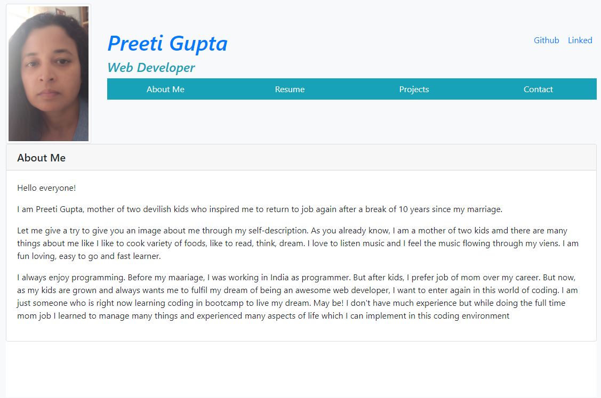
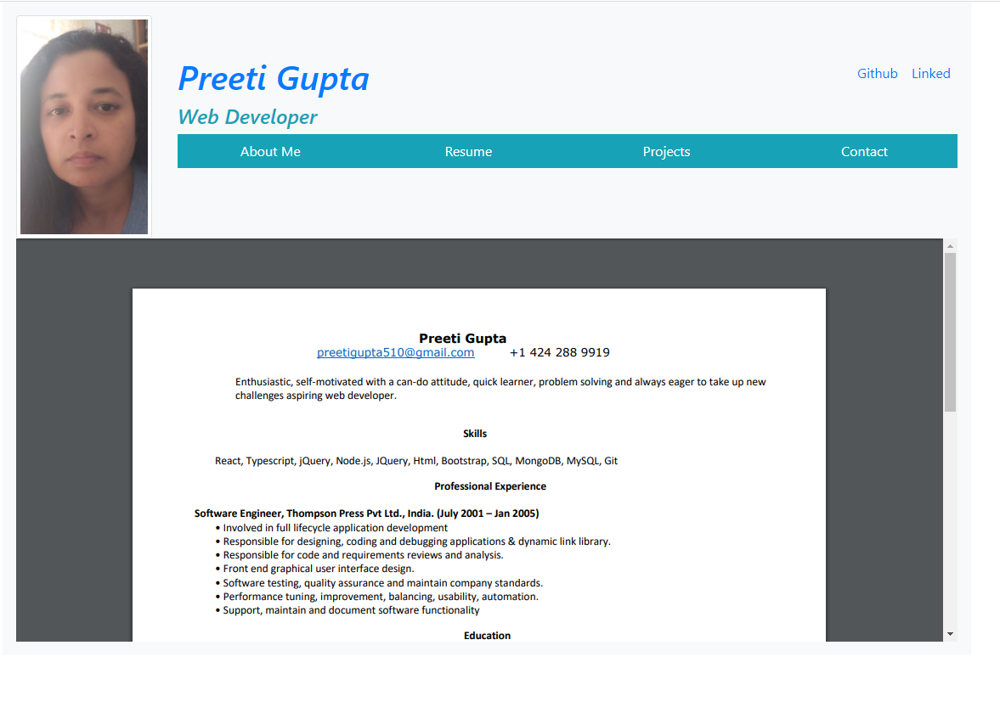
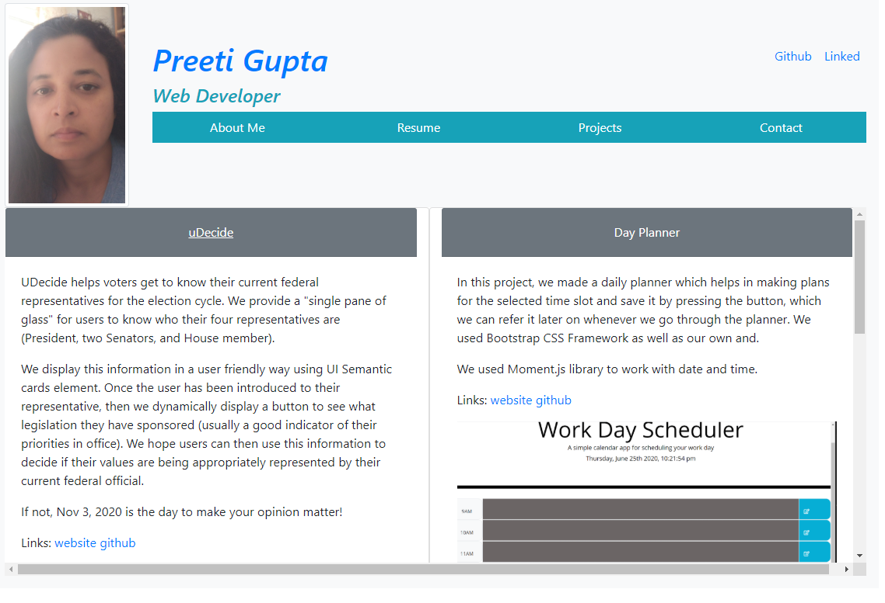
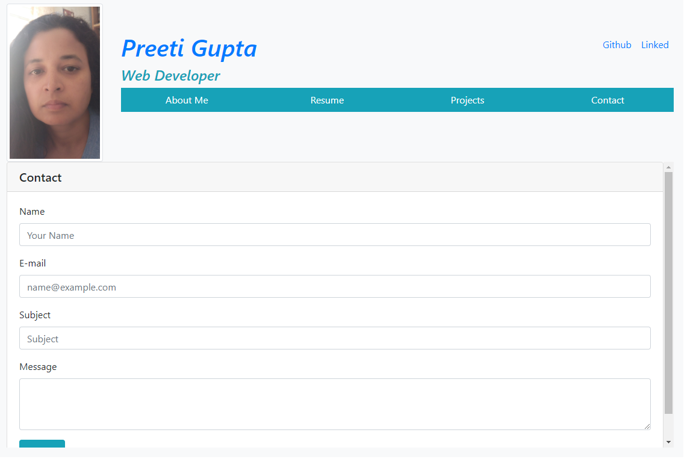

# Portfolio

The purpose of this assignment was to make responsive portfolio for mobile and tablet using Bootstrap CSS Framework.  
 

## Getting Started

### Prerequisites
1. Bootstrap Framework.(https://stackpath.bootstrapcdn.com/bootstrap/4.5.0/css/bootstrap.min.css)

2. *HTML*

3. *CSS*

4. *Javascript*

5. *jQuery*

##  Details of Project

Creating portfolio for myself which will work on both mobile and tablets. It has three pages
1. Home: By Default About me is displayed. It contains the link About me, Resume, Project, Contact.  
2. Resume: It contains my resume.
3. Project: It contains some of my work such as uDecide, workdays-schedular and Password Generator
4. Contact: It contains contact form.

By default About me is display. To view other pages use the navigation link which will open in the frame in my home page.

My Portfolio Website Link ->  (https://preeti1234567.github.io/Portfolio)

